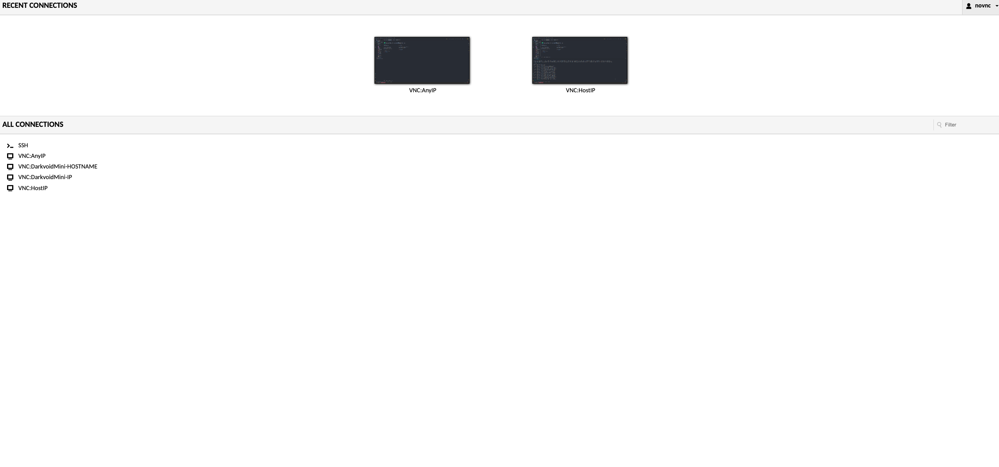

# NoVNC
Docker image for creating a simple, slim GUI for running application. We encourage customization of the `supervisord.conf`
for custom changes that allow you to run via VNC easily.

### Base Image

- [Alpine:Edge](https://hub.docker.com/_/alpine)

### Depends on

- [NoVNC](https://github.com/novnc/noVNC)
- [X11Vnc](https://linux.die.net/man/1/x11vnc) ([Docs](https://www.x.org/archive/X11R7.6/doc/man/man1/Xvfb.1.xhtml))
- [TigerVNC](https://github.com/TigerVNC/tigervnc) ([Docs](https://tigervnc.org/doc/Xvnc.html))

### Images

Two images are created:

1. influx6/novnc - regular vnc image with more base packages
2. influx6/novnc-light - a lighter version with just vnc packages

### Description

Run any application with a UI in docker and connect via browser.

Please replace all user variables in the above command defined by <> with the correct values.

**Example**
```
docker run -d \
    -p 5900:5900 \
    -p 6080:6080 \
    -p 7080:7080 \
    --name=novnc \
    -v ./config:/home/nobody/.idea \
    -e DISPLAY_WIDTH=<> \
    -e DISPLAY_HEIGHT=<> \
    -e DISPLAY_DEPTH=<> \
    -e VNC_SERVER=<x11 or tigervnc> (default: tigervnc) \
    -e VNC_PASSWORD=mypassword \
    -e GUACA_PASSWORD=mypassword \
    influx6/novnc:latest
```


## Displays 

NoVNC supports up to 5 independent displays, which can be used to connect independent of others, this allows you own and control each screen, displaying whatever you so wish.

Just be aware more vnc client and viewers means more power the underline host needs to have.

Each 5 displays are controlled by environment variables marked with a digit (we will use N to repesent said digit). 

See template:

```bash
DISPLAY_N=:1 # which display number will be used by tigervnc or x11vnc
VNC_SERVER_N=tigervnc  # which vnc server should be used
DISPLAY_SCREEN_N="1" # which screen should x11vnc setup on, check x11vnc docs at https://www.x.org/archive/X11R7.6/doc/man/man1/Xvfb.1.xhtml
ENABLE_SCREEN_N=1  # indicates if this screen is enabled
ENABLE_SCREEN_N_NOVNC=1 # indicates if the NoVNC web client should be started
TIGER_VNC_OPTS_N="" # indicates additional arguments to supply to tigervnc
X11_VNC_OPTS_N="" # indicates additional arguments to supper to x11vnc
DISPLAY_N_PORT=5901 # indicates which port should vnc serve on
DISPLAY_N_NOVNC_PORT=6800 # indicates which port NoVNC webclient will host http server on
```

So examples: A 5 display vnc server has the following settings with only 2 enabled

```bash

# display 1
DISPLAY_1=:1 
DISPLAY_SCREEN_1="0" 
ENABLE_SCREEN_1=1 
ENABLE_SCREEN_1_NOVNC=1 
VNC_SERVER_1=tigervnc 
TIGER_VNC_OPTS_1="" 
X11_VNC_OPTS_1="" 
DISPLAY_1_PORT=5901 
DISPLAY_1_NOVNC_PORT=6800 

# display 2
TIGER_VNC_OPTS_2="" 
VNC_SERVER_2=tigervnc 
DISPLAY_SCREEN_2="0" 
X11_VNC_OPTS_2="" 
DISPLAY_2_PORT=5902 
DISPLAY_2=:2 
DISPLAY_2_NOVNC_PORT=6802 
ENABLE_SCREEN_2=0 
ENABLE_SCREEN_2_NOVNC=0 

# display 3
ENABLE_SCREEN_3=0 
VNC_SERVER_3=tigervnc 
TIGER_VNC_OPTS_3="" 
DISPLAY_SCREEN_3="0" 
X11_VNC_OPTS_3="" 
DISPLAY_3_PORT=5903
DISPLAY_3_NOVNC_PORT=6803 
DISPLAY_3=:3 
ENABLE_SCREEN_3_NOVNC=0 

# display 4
ENABLE_SCREEN_4=0 
VNC_SERVER_4=tigervnc 
DISPLAY_SCREEN_4="0" 
TIGER_VNC_OPTS_4="" 
X11_VNC_OPTS_4="" 
DISPLAY_4_PORT=5904
DISPLAY_4_NOVNC_PORT=6804 
DISPLAY_4=:4 
ENABLE_SCREEN_4_NOVNC=0 

# display 5
ENABLE_SCREEN_5=0 
VNC_SERVER_5=tigervnc 
TIGER_VNC_OPTS_5="" 
DISPLAY_SCREEN_5="0" 
X11_VNC_OPTS_5="" 
DISPLAY_5_PORT=5905
DISPLAY_5_NOVNC_PORT=6805 
DISPLAY_5=:5 
ENABLE_SCREEN_5_NOVNC=0 
```

We can then set them up for connectivity in Guacamole using following `user-mapping.xml`

```bash
...
<connection name="SSH">
    <protocol>ssh</protocol>
    <param name="hostname">0.0.0.0</param>
    <param name="port">22</param>
    <param name="username">novnc</param>
    <param name="password">novnc</param>
    <param name="private-key">/home/novnc/.ssh/id_rsa</param>
</connection>
<connection name="Screen 1">
    <protocol>vnc</protocol>
    <param name="hostname">0.0.0.0</param>
    <param name="port">5901</param>
    <param name="password">{{VNC_PASSWORD}}</param>
    <param name="ignore-cert">true</param>
</connection>
<connection name="Screen 2">
    <protocol>vnc</protocol>
    <param name="hostname">0.0.0.0</param>
    <param name="port">5902</param>
    <param name="password">{{VNC_PASSWORD}}</param>
    <param name="ignore-cert">true</param>
</connection>
<connection name="Screen 3">
    <protocol>vnc</protocol>
    <param name="hostname">0.0.0.0</param>
    <param name="port">5903</param>
    <param name="password">{{VNC_PASSWORD}}</param>
    <param name="ignore-cert">true</param>
</connection>
<connection name="Screen 4">
    <protocol>vnc</protocol>
    <param name="hostname">0.0.0.0</param>
    <param name="port">5904</param>
    <param name="password">{{VNC_PASSWORD}}</param>
    <param name="ignore-cert">true</param>
</connection>
<connection name="Screen 5">
    <protocol>vnc</protocol>
    <param name="hostname">0.0.0.0</param>
    <param name="port">5905</param>
    <param name="password">{{VNC_PASSWORD}}</param>
    <param name="ignore-cert">true</param>
</connection>
```

## Guacamole Client

Installed with the VNC client is a guacamole client and server which can act as a better alternative to raw NoVNC web app for
accessing your service.

Simply navigate to: http://localhost:7080/guacamole

Default username and password are: novnc (password can be customized via environment variables `GUACA_PASSWORD`)



## NoVNC Web App

**Access via web interface (noVNC)**

`https://<host ip>:<host port>/vnc.html?resize=remote&host=<host ip>&port=<host port>&&autoconnect=1`

e.g.:-

`https://192.168.1.10:6080/vnc.html?resize=remote&host=192.168.1.10&port=6080&&autoconnect=1`

Project comes with a self-signed certificate, so you will have to tell your browser to load page regardless of warning.

**Access via VNC client**

`<host ip>::<host port>`

e.g.:-

`192.168.1.10::5900`

**Usage**
```
docker run -d \
    -p 5900:5900 \
    -p 6080:6080 \
    -p 7080:7080 \
    --name=<container name> \
    influx6/novnc:latest
```

To add another application, write your own docker file:

```docker-file
FROM influx6/novnc:latest
RUN \
    # Install xterm
    apk add xterm && \
    # Append xterm entry to supervisord.conf
    cd /etc/supervisord/ && \
    echo '[program:xterm]' > 03-myapp.conf && \
    echo 'command=xterm' >> 03-myapp.conf && \
    echo 'autorestart=true' >> 03-myapp.conf
```

**Notes**

User ID (PUID) and Group ID (PGID) can be found by issuing the following command for the user you want to run the container as:-

```
id <username>
```


### Gotcha

I noticed at times even when directly using Guacamole or other VNC client that the size of the display is usually small, 
I have yet to find a way to fix this, but the NoVNC client seems to have some underline logic that will force a resize of 
giving display, so if you see your desktop VNC client or Guacamole displaying a smaller size than your available desktop space, do the following:

1. Navigate to the NoVNC web login portal (see [NoVNC Web App](#novnc-web-app) section)
2. Login with your login credentials
3. NoVNC will show your desktop
4. Ensure resize=remote is enabled in settings
5. Apply settings if not.

You can also paste the following url with the correct options

`https://[ip]:6080/vnc.html?resize=remote&host=192.168.1.10&port=6080&&autoconnect=1`

These will correct the display size and will reflect on other VNC client you are using.

## Environment Variables

These are environment variables which can be customized as you see fit


```bash
DISPLAY= - display you wish to use (default is :0)

GUID - override GUID to match your external user groupd id

PUID - override PUID to match your external user id

TERM=xterm  - default terminal

LANG=en_US.UTF-8 

LANGUAGE=en_US.UTF-8 

LC_ALL=C.UTF-8 

TZ=Asia/Hong_Kong 

SECURITY_TYPE=None - security type for vnc and guacamole (can affect guacamole connectivity)

VNC_SERVER=tigervnc/x11

DISPLAY_DEPTH=24 

DISPLAY_WIDTH=1280 

DISPLAY_HEIGHT=1024 

DISPLAY_MAX=0/1/-1 - selects between 0 - default display size, 1 - max display size or -1 - auto display settings 

DISPLAY_WIDTH_MAX=1600  - max display width

DISPLAY_HEIGHT_MAX=1200  - max display height

LANG=en_GB.UTF-8 

GUACA_PASSWORD=novnc - password for guacamole ui login for user novnc

GUACA_SSL=true  - enable ssl mode for guacd

VNC_PASSWORD=novnc - password for vnc

TIGER_VNC_OPTS - add extra options to tiger vnc when VNC_SERVER=tiger

X11_VNC_OPTS - add extra options to x11vnc when VNC_SERVER=X11
```